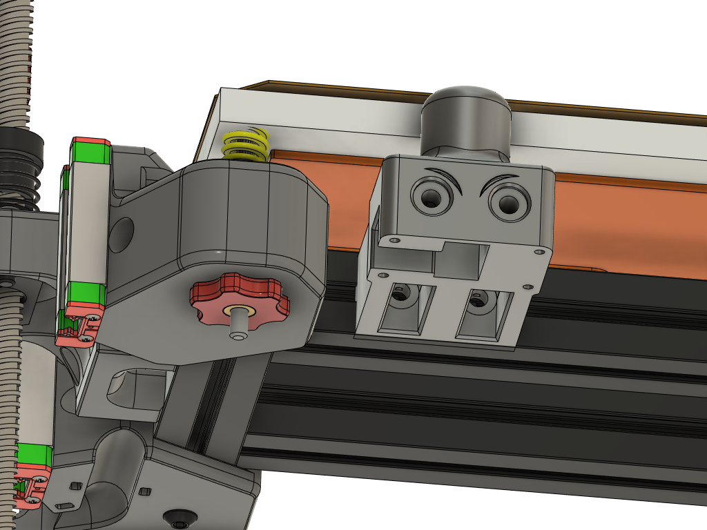

 ***Still in design phase.. use at your own risk. May cause space time disruption.***

**BOM**

 1 x HeartK Voron 2.4 Endstop switch      
 4 x M2x8 Self Tapping screws      
 3 x 5x7x8 Sleeve Bearing      
 1 x M3 x 20mm round amuminum standoff post ( 5MM od)   
      [Example of what to look for](https://www.aliexpress.com/item/2251832695751106.html?spm=a2g0o.productlist.0.0.39d572d1Ikaegt&algo_pvid=0ef968d6-c41a-4bf9-8728-aab261ae0f26&aem_p4p_detail=202207041141012168556211044480003127304&algo_exp_id=0ef968d6-c41a-4bf9-8728-aab261ae0f26-4&pdp_ext_f=%7B%22sku_id%22%3A%2265705928134%22%7D&pdp_npi=2%40dis%21USD%21%212.23%21%21%21%21%21%402132f35216569600607318207ec8b9%2165705928134%21sea). I did not buy from this store.. Just using them as a reference for the type of post you need.    
 2 x M3 x 8mm Flat CAP screw      
 1 X M5 Stainless Fender Washer 15mm OD      
 2 x M3 standard washer      
 2x M3 x 8mm or 10mm button head screws      
 2x M3 square or hex nuts      
 220 and 400 grit sandpaper for deburing the fender washer and sizing the standoff post if needed.      
 
 I like the Deepfriedhero [endstop super kit for the switch and bearings.](https://deepfriedhero.in/products/voron-2-4-sexbolt-z-endstop-super-kit?_pos=4&_sid=4148419ee&_ss=r) if you are in the USA      
 
 You will want to deburr the stamped fender washer.. I sanded it flat on a smooth surface with the 220 then bolted it to the standoff post, chucked it in my drill and polished the edges with 400 grit. You may also like to chamfer the ID so the M3 flat cap screw sits flush.  No impact to performance if you don't but you won't have to worry about the klicky switch body hitting it instead if you set up auto Z offset.           
 
 out a 20 pack of M3 standoff posts I bought form Amazon only 3 were the proper 5mm OD. you may need to chuck the post in a drill and lightly sand with 400 grit it till it slides smoothly in the sleeve bearing. 
 
 I use this switch in combination with [Zruncho3d's  Zeroclick Z probe.](https://github.com/zruncho3d/ZeroClick)      
 
 
 

